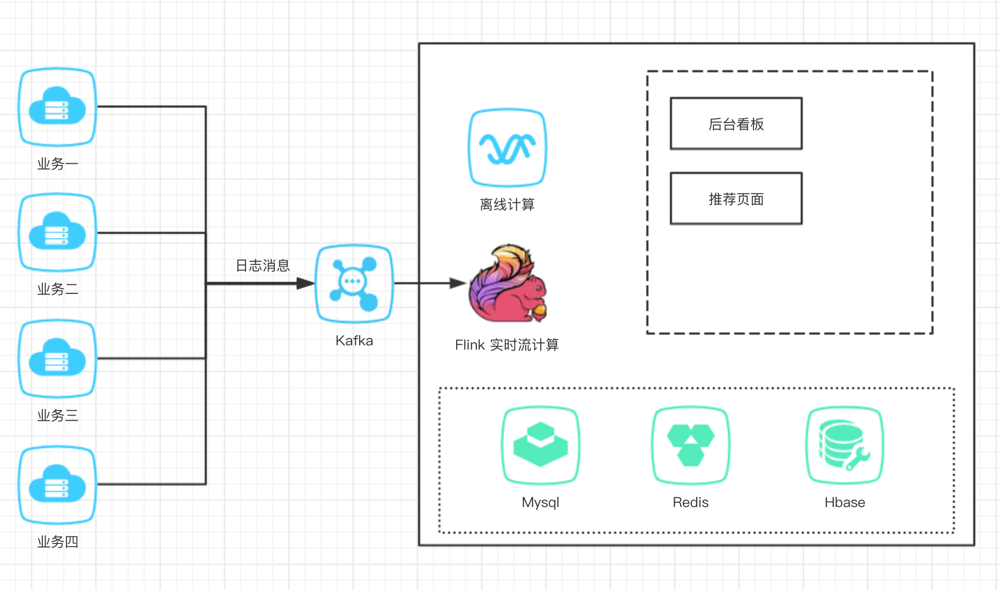

# 商品实时推荐系统

### 1. 系统架构  v2.0

- **1.1 系统架构图**

  <div align=center></div>

- **1.2模块说明**

- a.在日志数据模块(flink-2-hbase)中,又主要分为6个Flink任务:

  - 用户-产品浏览历史  -> 实现基于协同过滤的推荐逻辑 

    通过Flink去记录用户浏览过这个类目下的哪些产品,为后面的基于Item的协同过滤做准备
    实时的记录用户的评分到Hbase中,为后续离线处理做准备.

    数据存储在Hbase的p_history表

  - 用户-兴趣 -> 实现基于上下文的推荐逻辑

    根据用户对同一个产品的操作计算兴趣度,计算规则通过操作间隔时间(如购物 - 浏览 < 100s)则判定为一次兴趣事件
    通过Flink的ValueState实现,如果用户的操作Action=3(收藏),则清除这个产品的state,如果超过100s没有出现Action=3的事件,也会清除这个state

    数据存储在Hbase的u_interest表

  - 用户画像计算 -> 实现基于标签的推荐逻辑

    v1.0按照三个维度去计算用户画像,分别是用户的颜色兴趣,用户的产地兴趣,和用户的风格兴趣.根据日志不断的修改用户画像的数据,记录在Hbase中.

    数据存储在Hbase的user表

  - 产品画像记录  -> 实现基于标签的推荐逻辑

    用两个维度记录产品画像,一个是喜爱该产品的年龄段,另一个是性别

    数据存储在Hbase的prod表

  - 事实热度榜 -> 实现基于热度的推荐逻辑 

    通过Flink时间窗口机制,统计当前时间的实时热度,并将数据缓存在Redis中.

    通过Flink的窗口机制计算实时热度,使用ListState保存一次热度榜

    数据存储在redis中,按照时间戳存储list

  - 日志导入

    从Kafka接收的数据直接导入进Hbase事实表,保存完整的日志log,日志中包含了用户Id,用户操作的产品id,操作时间,行为(如购买,点击,推荐等).

    数据按时间窗口统计数据大屏需要的数据,返回前段展示

    数据存储在Hbase的con表

- b. web模块

  - 前台用户界面

    该页面返回给用户推荐的产品list

  - 后台监控页面

    该页面返回给管理员指标监控


### 2.推荐引擎逻辑说明

- **2.1 基于热度的推荐逻辑**

  现阶段推荐逻辑图

<div align=center></div>

​    根据用户特征，重新排序热度榜，之后根据两种推荐算法计算得到的产品相关度评分，为每个热度榜中的产品推荐几个关联的产品

- **2.2 基于产品画像的产品相似度计算方法**

  基于产品画像的推荐逻辑依赖于产品画像和热度榜两个维度,产品画像有三个特征,包含color/country/style三个角度,通过计算用户对该类目产品的评分来过滤热度榜上的产品

  <div align=center></div>

  在已经有产品画像的基础上,计算item与item之间的关联系,通过**余弦相似度**来计算两两之间的评分,最后在已有物品选中的情况下推荐关联性更高的产品.

| 相似度 | A    | B    | C    |
| ------ | ---- | ---- | ---- |
| A      | 1    | 0.7  | 0.2  |
| B      | 0.7  | 1    | 0.6  |
| C      | 0.2  | 0.6  | 1    |

  

- **2.3 基于协同过滤的产品相似度计算方法**

  根据产品用户表（Hbase） 去计算公式得到相似度评分：

  
                 

### 3. 前台推荐页面

​	当前推荐结果分为3列,分别是热度榜推荐,协同过滤推荐和产品画像推荐

<div align=center></div>

### 4. 后台数据大屏

​	**在后台上显示推荐系统的实时数据**,数据来自其他Flink计算模块的结果.目前包含热度榜和1小时日志接入量两个指标. 
真实数据位置在resource/database.sql

<div align=center></div>

### 5. 部署说明 

需要的服务有：Mysql、Redis、Hbase和Kafka,建议使用Docker部署(如果对Docker不熟悉，可以简单的把[Docker专栏](https://blog.csdn.net/qqHJQS/column/info/33078)看一看， 很快就会上手)

#### Mysql
```
docker pull mysql:5.7

docker run --name local-mysql -p 3308:3306  -e MYSQL_ROOT_PASSWORD=123456 -d mysql:5.7
```
比较简单，先拉取镜像，然后指定参数启动容器
- `--name local-mysql` 容器名为local-mysql
- `-p 3308:3306`       宿主机与容器的端口映射为3308:3306 即你防伪宿主机的3308就是访问容器的3306端口，需要理解下
- `-e MYSQL_ROOT_PASSWORD=123456` 容器内的变量名`MYSQL_ROOT_PASSWORD`对应的值为123456 即mysql的root密码为123456
- `-d` 后台启动


#### Redis
https://hub.docker.com/_/redis

```bash
$ docker run --name local-redis -p 6379:6379 -d redis
```
直接执行脚本即可

#### Hbase
##### pull镜像

`docker pull harisekhon/hbase`

##### 启动脚本

```bash
docker run -d -h base-server \
        -p 2181:2181 \
        -p 8080:8080 \
        -p 8085:8085 \
        -p 9090:9090 \
        -p 9000:9000 \
        -p 9095:9095 \
        -p 16000:16000 \
        -p 16010:16010 \
        -p 16201:16201 \
        -p 16301:16301 \
        -p 16020:16020\
        --name hbase \
        harisekhon/hbase

```


hbase对应的端口(harisekhon/hbase 修改了默认端口：)
```text
# Stargate 8080 / 8085
# Thrift 9090 / 9095
# HMaster 16000 / 16010
# RS 16201 / 16301
EXPOSE 2181 8080 8085 9090 9095 16000 16010 16201 16301

```
注意客户端要使用的端口号是

##### 设置host
```text
127.0.0.1       base-server
```

webui in http://localhost:16010/master-status
[快速实现springboot集成Hbase](https://github.com/vector4wang/spring-boot-quick/tree/master/quick-hbase)
#### Kafka
考虑到更好的区别这些端口，我这里启动了一个虚拟机，在虚拟机中在用dokcer安装Kafka，过程如下

##### download images
```bash
docker pull wurstmeister/zookeeper
docker pull wurstmeister/kafka
docker pull sheepkiller/kafka-manager
```


##### run zookepper
```bash
docker run -d --name zookeeper --publish 2181:2181 \
  --volume /etc/localtime:/etc/localtime \
  --restart=always \
  wurstmeister/zookeeper
```


##### run kafka

```bash
docker run --name kafka \
  -p 9092:9092 \
  --link zookeeper:zookeeper \
  -e KAFKA_ADVERTISED_HOST_NAME=192.168.1.8 \
  -e KAFKA_ZOOKEEPER_CONNECT=zookeeper:2181 \
  -d  wurstmeister/kafka  
```

##### run kafka manager
```bash
docker run -d \
  --link zookeeper:zookeeper \
  -p 9000:9000  \
  -e ZK_HOSTS="zookeeper:2181" \
  hlebalbau/kafka-manager:stable \
  -Dpidfile.path=/dev/null
```
如果想设置webui 的权限，可以这样设置

```bash
KAFKA_MANAGER_AUTH_ENABLED: "true"
KAFKA_MANAGER_USERNAME: username
KAFKA_MANAGER_PASSWORD: password
```

web ui in `localhost:9000`


[快速实现springboot集成Kafka](https://github.com/vector4wang/spring-boot-quick/tree/master/quick-kafka)

#### 启动服务

将上述部署的几个服务的ip和端口号分别配置在flink-2-hbase和web服务中，然后首先在flink-2-hbase中的根目录执行`mvn clean install`目的是将其打包并放置在本地仓库中，然后再分别启动task目录下的task，直接在idea中右键启动就行了；接着把SchedulerJob启动起来，定时的去结算协同过滤和用户画像所需要的分数;

然后在idea中打开web项目，等待其自动引入web-flink-hbase生成的jar包之后，最后启动服务就ok了；


所有的服务启动后，因为没有任何的点击记录，所以没有什么推荐，这里需要你在推荐页面随便点击，等达到一定的历史数据，就能实现实时推荐的效果了


### 6. 下一步工作

1. 完善数据大屏,显示更详细的指标
2. 统计召回率/准确率等业务指标

