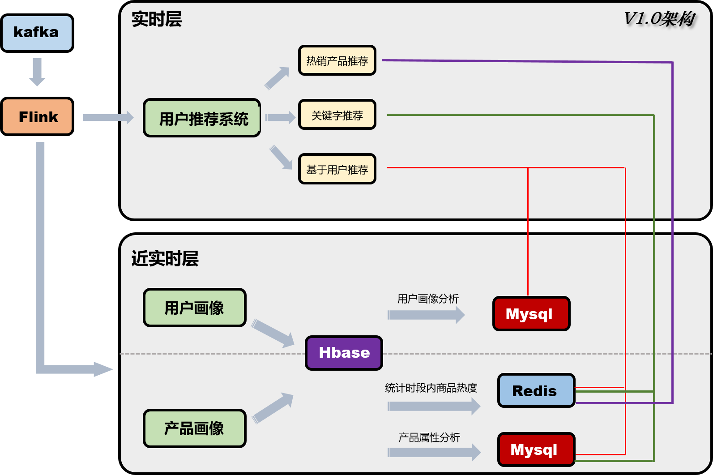
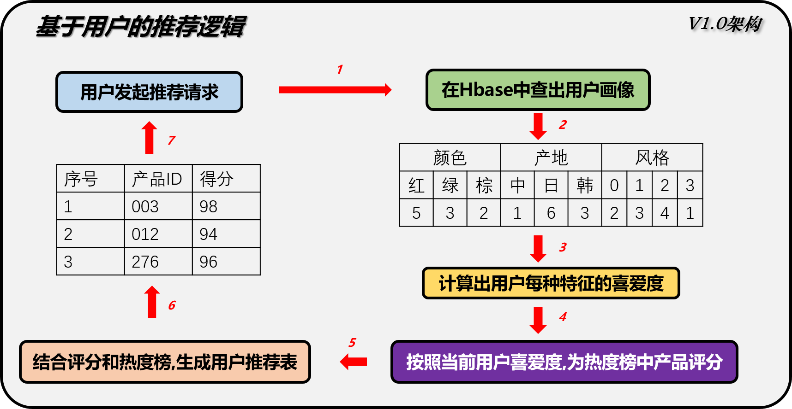

# 商品实时推荐系统

## V1.0架构

### 1. 系统架构

​	当前系统主要分为两个模块,分别是日志数据导入Hbase(flink-2-hbase)和用户推荐模块(web)

 - 在日志数据模块(flink-2-hbase)中,又主要分为5个部分:

   - **日志导入**:

     从Kafka接收的数据直接导入进Hbase事实表,保存完整的日志log,日志中包含了用户Id,用户操作的产品id,操作时间,行为(如购买,点击,推荐等).

     数据按时间窗口统计数据大屏需要的数据,返回前段展示

   - **用户画像计算:**

     v1.0按照三个维度去计算用户画像,分别是用户的颜色兴趣,用户的产地兴趣,和用户的风格兴趣.根据日志不断的修改用户画像的数据,记录在Hbase中.

   - **产品画像记录**

     用两个维度记录产品画像,一个是喜爱该产品的年龄段,另一个是性别

   - **事实热度榜:**

     通过Flink时间窗口机制,统计当前时间的实时热度,并将数据缓存在Redis中.

     通过Flink的窗口机制计算实时热度,保存状态

   - **用户-产品浏览历史**

     通过Flink去记录用户浏览过这个类目下的哪些产品,为后面的基于Item的协同过滤做准备
     在处理每个用户的记录时,保存用户操作记录到state中(使用FsState),如果用户连续操作(如浏览->收藏->购物)时间短,则触发更评分,反之普通评分.
     实时的记录用户的评分到Hbase中,为后续离线处理做准备

 - 系统架构图

### 2.基于热度和基于标签的推荐逻辑

 - **2.1 基于热度的推荐逻辑**

   在V1.0架构中,基于用户画像的推荐逻辑依赖于用户画像和热度榜两个维度,用户画像有三个特征,包含color/country/style三个角度,通过计算用户对该类目产品的评分来过滤热度榜上的产品

​    根据用户特征，重新排序热度榜，之后根据两种推荐算法计算得到的产品相关度评分，为每个热度榜中的产品推荐几个关联的产品

 - **2.2 基于标签的产品相似度计算方法**

  在已经有产品画像的基础上,计算item与item之间的关联系,通过**余弦相似度**来计算两两之间的评分,最后在已有物品选中的情况下推荐关联性更高的产品.

| 相似度 | A    | B    | C    |
| ------ | ---- | ---- | ---- |
| A      | 1    | 0.7  | 0.2  |
| B      | 0.7  | 1    | 0.6  |
| C      | 0.2  | 0.6  | 1    |

  

- **2.3 基于协同过滤的产品相似度计算方法**

  根据产品用户表（Hbase） 去计算公式得到相似度评分：
  
  
                 

### 下一步工作
1. 添加基于上下文的推荐逻辑，对kafka数据分组，然后对一个用户的顺序操作（点击->购买）给与更高的权重
2. 将实时数据做大屏统计,返回给前段展示
3. 统计召回率/准确率等业务指标

