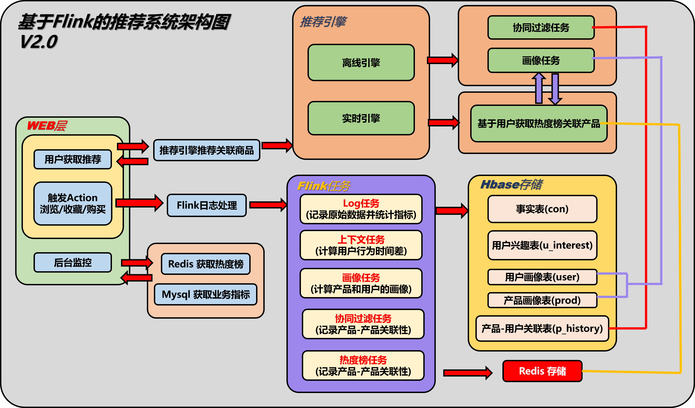
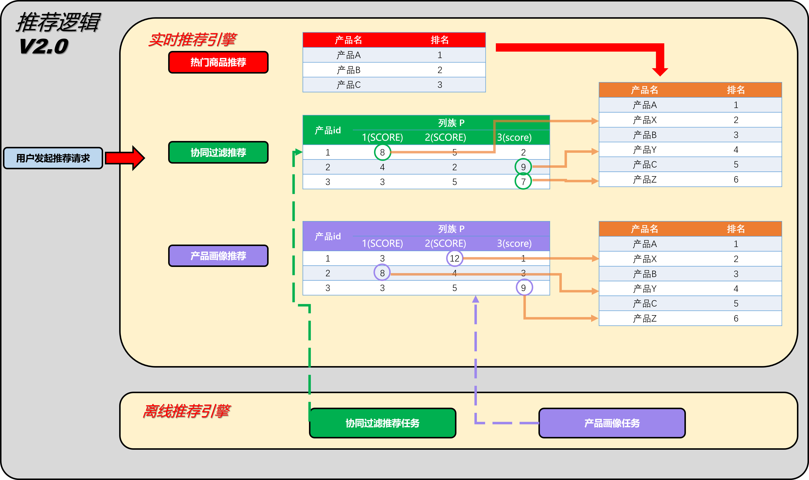
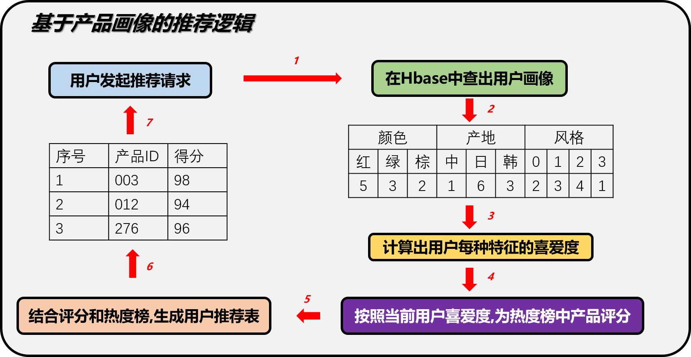
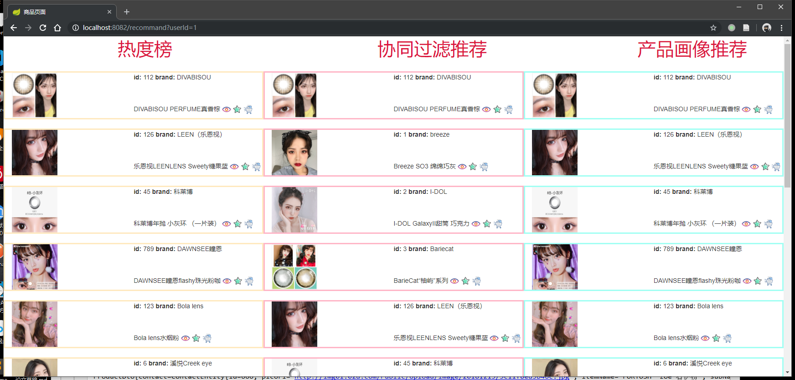
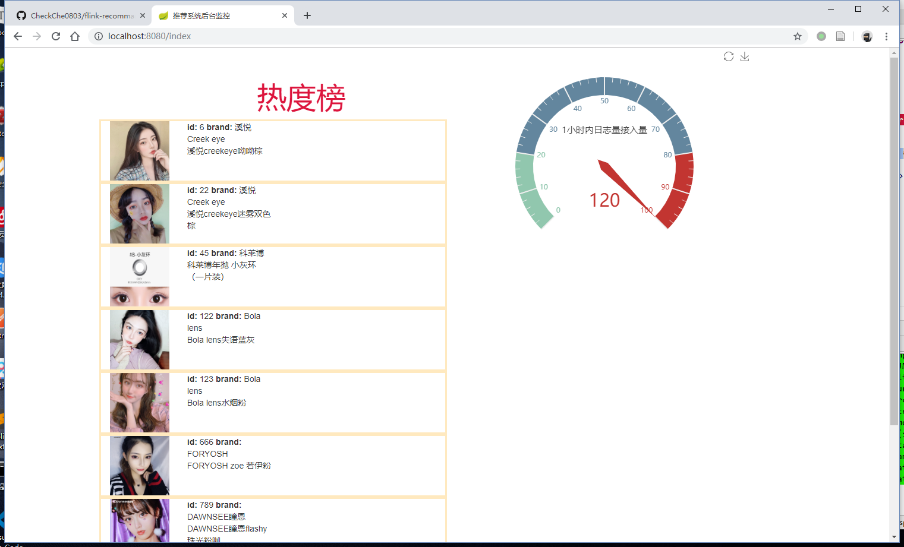

# 商品实时推荐系统

### 1. 系统架构  v2.0

- **1.1 系统架构图**

  

- **1.2模块说明**

- a.在日志数据模块(flink-2-hbase)中,又主要分为6个Flink任务:

  - 用户-产品浏览历史  -> 实现基于协同过滤的推荐逻辑 

    通过Flink去记录用户浏览过这个类目下的哪些产品,为后面的基于Item的协同过滤做准备
    实时的记录用户的评分到Hbase中,为后续离线处理做准备.

    数据存储在Hbase的p_history表

  - 用户-兴趣 -> 实现基于上下文的推荐逻辑

    根据用户对同一个产品的操作计算兴趣度,计算规则通过操作间隔时间(如购物 - 浏览 < 100s)则判定为一次兴趣事件
    通过Flink的ValueState实现,如果用户的操作Action=3(收藏),则清除这个产品的state,如果超过100s没有出现Action=3的事件,也会清除这个state

    数据存储在Hbase的u_interest表

  - 用户画像计算 -> 实现基于标签的推荐逻辑

    v1.0按照三个维度去计算用户画像,分别是用户的颜色兴趣,用户的产地兴趣,和用户的风格兴趣.根据日志不断的修改用户画像的数据,记录在Hbase中.

    数据存储在Hbase的user表

  - 产品画像记录  -> 实现基于标签的推荐逻辑

    用两个维度记录产品画像,一个是喜爱该产品的年龄段,另一个是性别

    数据存储在Hbase的prod表

  - 事实热度榜 -> 实现基于热度的推荐逻辑 

    通过Flink时间窗口机制,统计当前时间的实时热度,并将数据缓存在Redis中.

    通过Flink的窗口机制计算实时热度,使用ListState保存一次热度榜

    数据存储在redis中,按照时间戳存储list

  - 日志导入

    从Kafka接收的数据直接导入进Hbase事实表,保存完整的日志log,日志中包含了用户Id,用户操作的产品id,操作时间,行为(如购买,点击,推荐等).

    数据按时间窗口统计数据大屏需要的数据,返回前段展示

    数据存储在Hbase的con表

- b. web模块

  - 前台用户界面

    该页面返回给用户推荐的产品list

  - 后台监控页面

    该页面返回给管理员指标监控

### 2.推荐引擎逻辑说明

- **2.1 基于热度的推荐逻辑**

  现阶段推荐逻辑图

​    根据用户特征，重新排序热度榜，之后根据两种推荐算法计算得到的产品相关度评分，为每个热度榜中的产品推荐几个关联的产品

- **2.2 基于产品画像的产品相似度计算方法**

  基于产品画像的推荐逻辑依赖于产品画像和热度榜两个维度,产品画像有三个特征,包含color/country/style三个角度,通过计算用户对该类目产品的评分来过滤热度榜上的产品

  

  在已经有产品画像的基础上,计算item与item之间的关联系,通过**余弦相似度**来计算两两之间的评分,最后在已有物品选中的情况下推荐关联性更高的产品.

| 相似度 | A    | B    | C    |
| ------ | ---- | ---- | ---- |
| A      | 1    | 0.7  | 0.2  |
| B      | 0.7  | 1    | 0.6  |
| C      | 0.2  | 0.6  | 1    |

  

- **2.3 基于协同过滤的产品相似度计算方法**

  根据产品用户表（Hbase） 去计算公式得到相似度评分：

  
                 

### 3. 前台推荐页面

​ 当前推荐结果分为3列,分别是热度榜推荐,协同过滤推荐和产品画像推荐

### 4. 后台数据大屏

​ **在后台上显示推荐系统的实时数据**,数据来自其他Flink计算模块的结果.目前包含热度榜和1小时日志接入量两个指标. 
真实数据位置在resource/database.sql

### 5. 部署说明 
>以下的部署均使用Docker，对于搭建一套复杂的系统，使用docker来部署各种服务中间件再合适不过了。这里有一套简单的[Docker入门系列](https://blog.csdn.net/qqHJQS/column/info/33078)

详细的部署说明已经写了一篇文章来说明了，按照流程即可运行项目，无需自己搭建任何组件。
[文章地址](https://xinze.fun/2019/11/19/%E4%BD%BF%E7%94%A8Docker%E9%83%A8%E7%BD%B2Flink%E5%A4%A7%E6%95%B0%E6%8D%AE%E9%A1%B9%E7%9B%AE/)
     
Hbase部署说明->[使用Docker搭建伪分布式Hbase(外置Zookeeper)](https://www.jianshu.com/p/3aabe3a152a8)    
Kafka部署说明->[使用Docker部署Kafka时的网络应该如何配置](https://www.jianshu.com/p/52a505354bbc)    

### 6. Q & A
1. 是否一定要使用Docker来部署环境？   
不是的，项目刚开始写的时候都是通过独立的组件来实现功能的。后来为了让大家能够迅速的体验项目，省略搭建过程 才配置了多个Docker环境。所以如果有自己有Kafka 或者 Hbase 的搭建经验，更推荐自搭建的形式，这样更容易解决问题。

2. 部署Docker带来的一系列问题   
包括端口号/连接异常等等问题，多数原因是不同的服务器环境带来的，建议首先检查自己的防火墙等基础设施配置是否能够支持各个组件的连接。

3. 个人广告 / 大数据面试咨询服务   
针对大数据零基础的小白 or 应届生提供的面试咨询 & 简历修改服务。纯沟通向，价格便宜，欢迎打扰～

